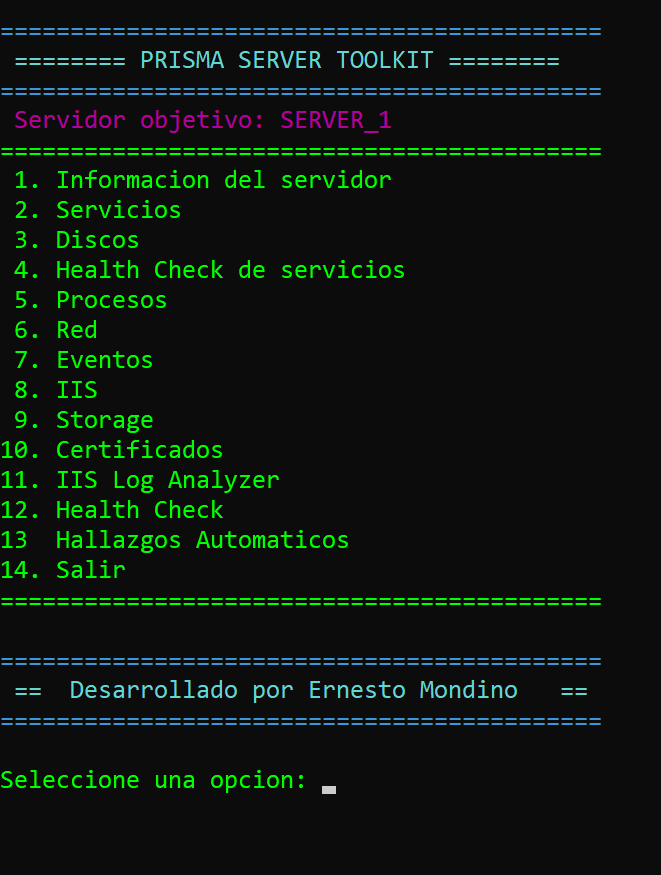
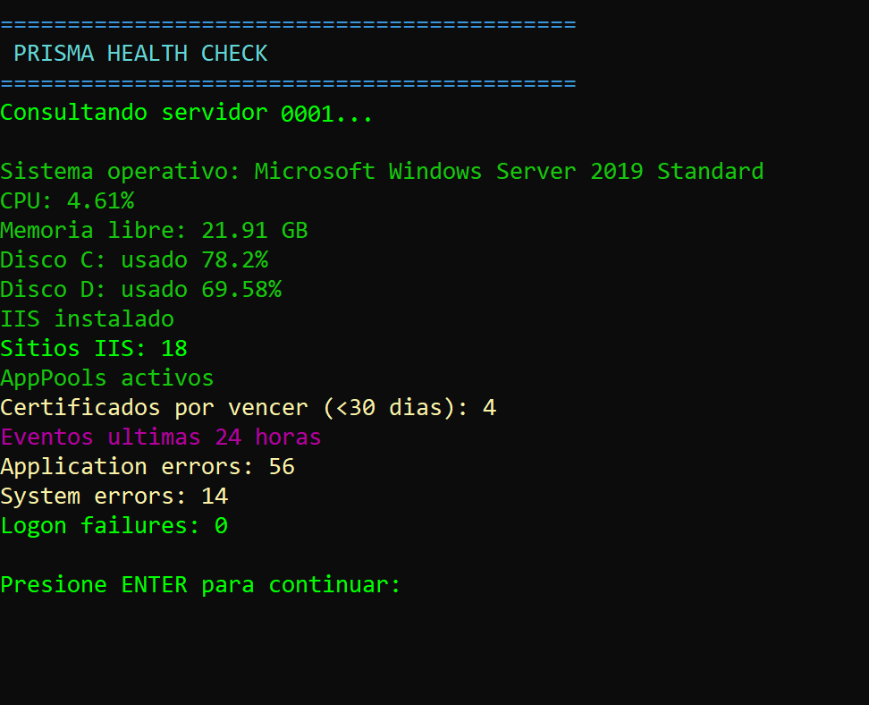
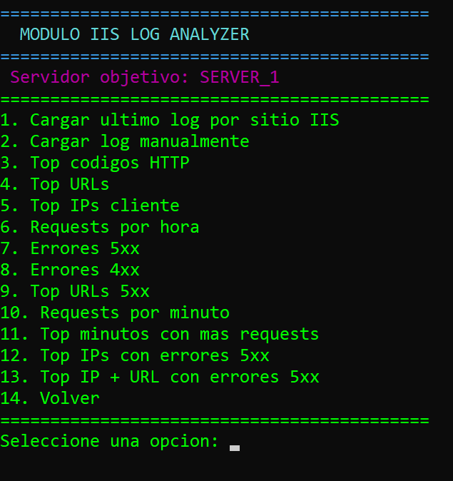

# PRISMA Server Toolkit

**PRISMA** (Panel de Recolección Inteligente de Sistemas y Monitoreo Automatizado) es una herramienta de administración y diagnóstico de servidores Windows desarrollada en PowerShell.

El objetivo de PRISMA es ofrecer a los administradores de sistemas una consola centralizada que permita realizar rápidamente tareas comunes de diagnóstico y operación sobre servidores remotos.

El toolkit está diseñado para entornos de producción donde es necesario obtener información rápidamente sin navegar múltiples consolas administrativas.

---

## Versión

**PRISMA Server Toolkit v1.0**

Esta versión incluye módulos para diagnóstico del sistema, administración de servicios, inspección de IIS, análisis de eventos, revisión de almacenamiento, análisis de logs IIS y un Health Check general del servidor.

---

## Características

PRISMA permite consultar y administrar remotamente servidores Windows mediante **PowerShell Remoting**.

Actualmente incluye los siguientes módulos:

### Servicios
- Listar servicios
- Consultar estado
- Iniciar / detener / reiniciar servicios
- Manejo de dependencias

### Información del servidor
- Sistema operativo
- CPU
- Memoria
- Información básica del host
- Sesiones de usuario activas (`query session`)

### Discos
- Espacio total
- Espacio libre
- Estado de discos

### Health Check
Chequeo rápido del estado general del servidor:

- Sistema operativo
- CPU
- Memoria libre
- Uso de discos
- Estado de IIS
- Cantidad de sitios IIS
- App Pools detenidos
- Certificados próximos a vencer
- Eventos recientes de Application / System / Security

### Procesos
- Top procesos por CPU
- Top procesos por memoria
- Búsqueda de procesos
- Procesos con usuario asociado

### Red
- Configuración IP
- Puertos en escucha
- Asociación puerto → proceso
- Búsqueda de puerto específico

### Eventos
Consulta de logs de Windows:

- Errores de **Application**
- Errores de **System**
- Fallos de logon (**EventID 4625**)
- Búsqueda de eventos por texto

### IIS

Administración básica de **Application Pools**:

- Listado de App Pools
- Consulta de estado
- Identidad del pool
- Iniciar App Pool
- Detener App Pool
- Reciclar App Pool

Administración de **Sitios IIS**:

- Listar sitios
- Consultar sitio
- Iniciar sitio
- Detener sitio

### IIS SSL Inspector

Permite inspeccionar los certificados HTTPS utilizados por IIS.

Muestra:

- Sitio
- Estado
- Binding
- CN del certificado
- Fecha de vencimiento
- Días restantes

Esto permite detectar rápidamente certificados próximos a expirar.

### IIS Log Analyzer

PRISMA incluye un módulo avanzado de análisis de logs de IIS orientado a troubleshooting de aplicaciones web en producción.

Este módulo permite cargar automáticamente el último log de un sitio IIS o analizar archivos de log manualmente.

Funciones disponibles:

- Top códigos HTTP
- Top URLs más solicitadas
- Top IPs cliente
- Requests por hora
- Requests por minuto
- Top minutos con mayor tráfico
- Detección de errores 5xx
- Detección de errores 4xx
- Top URLs que generan errores 5xx
- Top IPs que generan errores 5xx
- Top combinación IP + URL que genera errores 5xx

Esto permite detectar rápidamente:

- endpoints problemáticos
- picos de tráfico
- consumidores descontrolados
- patrones de error en aplicaciones

El análisis se realiza directamente sobre los logs estándar de IIS ubicados en:

C:\inetpub\logs\LogFiles


La herramienta interpreta automáticamente los campos del log y genera estadísticas útiles para diagnóstico de incidentes.
### Certificados

Consulta de certificados del store:

LocalMachine\My


Funciones disponibles:

- Listar certificados
- Buscar certificados por texto
- Detectar certificados próximos a vencer
- Certificados Vencidos usados por IIS

### Storage

Análisis de uso de almacenamiento:

- Top carpetas por tamaño
- Top archivos por tamaño
- Analizar raiz de disco
- Analizar ruta manual

Esto es útil para detectar:

- crecimiento de logs
- dumps
- archivos temporales
- consumo inesperado de disco

### Hallazgos Automaticos

PRISMA analiza automáticamente:

- Uso de discos (alertas por porcentaje)
- Eventos críticos de IIS / AppPools
- Certificados vencidos con reemplazo

---

## Use Cases

PRISMA está pensado para administradores de sistemas que necesitan diagnosticar rápidamente servidores Windows en producción.

Ejemplos de uso:

- Detectar procesos que consumen memoria o CPU
- Ver puertos abiertos y procesos asociados
- Analizar logs de IIS para detectar errores en APIs
- Detectar certificados próximos a vencer
- Realizar un health check rápido del servidor

---

## Screenshots

### Menu principal


### Health Check


### IIS Log Analyzer



## Requisitos

- Windows Server
- PowerShell **5.1** o superior
- Permisos administrativos en el servidor objetivo
- Acceso remoto habilitado (**WinRM**) para consultas remotas

Para funcionalidades IIS se requiere:

- Módulo `WebAdministration`
- Servidor con IIS instalado
- PowerShell Remoting habilitado

Para habilitar remoting:

```powershell
Enable-PSRemoting -Force
```

## Ejecución
Ejecutar el script principal en PowerShell:

```powershell
.\PRISMA-Server-Toolkit.ps1 SERVIDOR
```

## Filosofía del proyecto

PRISMA fue creado con el objetivo de:

- simplificar diagnósticos en servidores de producción
- reducir tiempo de análisis de incidentes
- unificar herramientas administrativas comunes
- facilitar la operación diaria de los administradores de sistemas

La herramienta está pensada para evolucionar con nuevos módulos según las necesidades operativas.

## Licencia

Proyecto experimental desarrollado con fines de automatización y administración de sistemas.

## Autor

Ernesto Mondino

Administrador de sistemas Windows

Banco de la Nación Argentina

Proyecto en desarrollo.